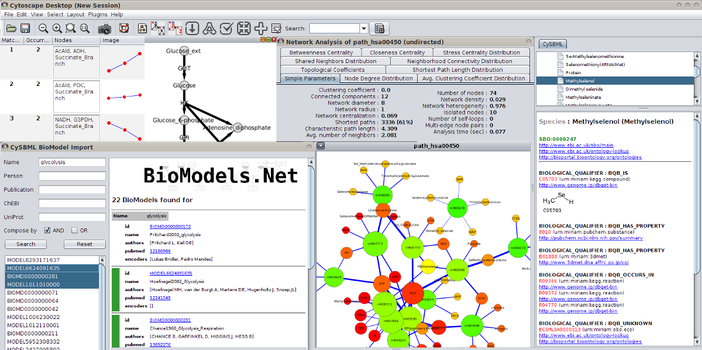
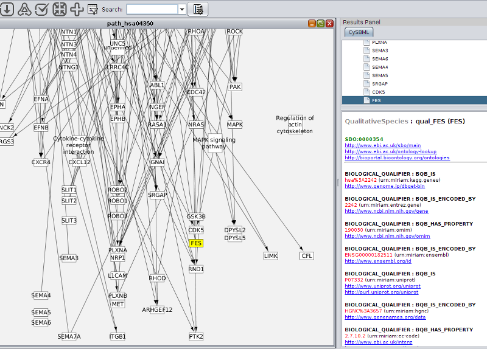
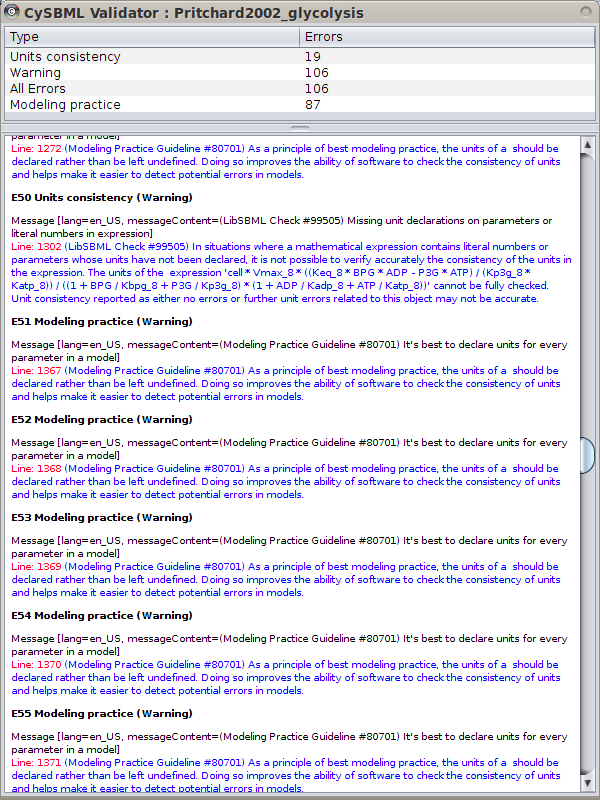

<a href="{{site.github.repository_url}}/blob/gh-pages/{{page.path}}">Edit this page</a>

# Overview
  
cy2sbml is an open source [Cytoscape 2](http://www.cytoscape.org) plugin for the Systems Biology Markup Language [SBML](http://sbml.org/Main_Page).  

**Latest release**  
https://github.com/matthiaskoenig/cy2sbml/releases/latest  
**Installation instructions & source code**  
https://github.com/matthiaskoenig/cy2sbml/  
**Support & Forum**: https://groups.google.com/forum/#!forum/cysbml-cyfluxviz  
**Bug Tracker**: https://github.com/matthiaskoenig/cy2sbml/issues

For Cytoscape 3 use [cy3sbml](https://github.com/matthiaskoenig/cy3sbml).

## Features
cy2sbml provides advanced functionality for the import and work with models encoded in SBML, amongst others the visualization of SBML network annotations within the network context, direct import of models from repositories like biomodels and one-click access to annotation resources and SBML model information and SBML validation.

* Java based SBML parser for Cytoscape based on the java SBML library [JSBML](http://sbml.org/Software/JSBML)
* simple access to SBML models and SBML annotations via [BioModels](http://www.biomodels.org/) and [MIRIAM](http://www.ebi.ac.uk/miriam/main/) web services
* supports all versions of SBML
* support of SBML Layout Package
* support of SBML Qualitative Models Package
* provides SBML validation (SBML warnings and errors accessible)
* creates standard network layout based on the SBML species/reaction model
* provides access to RDF based annotation information within the network context
* Navigation menu based on the SBML structure linked to layout and annotation information
* tested with all SBML.org and Biomodels.org test cases (sbml-test-cases-2.0.2, BioModels_Database-r21-sbml_files)

## Citation
> Matthias König, Andreas Dräger and Hermann-Georg Holzhütter  
CySBML: a Cytoscape plugin for SBML  
Bioinformatics.  2012 Jul 5. [PMID:22772946](http://www.pubmed.org/22772946)

cy2sbml was developed by [Matthias König](http://www.charite.de/sysbio/people/koenig/) in cooperation with [Andreas Dräger](http://www.ra.cs.uni-tuebingen.de/mitarb/draeger/) from the Center of Bioinformatics Tuebingen (ZBIT) within the [Virtual Liver Network](http://www.virtual-liver.de).  
We thank Camille Laibe for implementing additional BioModel WebService functionality, the Qual Team and Finja Büchel, Florian Mittag, and Nicolas Rodriguez (Qual implementation in JSBML), Sebastian Fröhlich and Clemens Wrzodek (Layout support in JSBML).

<a href="http://www.virtual-liver.de"></img></a>&nbsp;&nbsp;&nbsp;&nbsp;
<a href="http://www.charite.de"></img></a>&nbsp;&nbsp;&nbsp;&nbsp;
<a href="http://www.cytoscape.org"></img></a>&nbsp;&nbsp;&nbsp;&nbsp;
<a href="http://www.sbml.org"></img></a>&nbsp;&nbsp;

# Usage guide
## Tutorial
The [cy2sbml tutorial](./docs/cy2sbml-v1.2-tutorial.pdf) covers

* Installation
* cy2sbml interface
* import of SBML models
* Access to annotation information
* SBML validation in cy2sbml
* programmatic Interaction with cy2sbml

## Menu Bar
The main functionality of CySBML is accessible via the Cytoscape menu bar in the top region of the Cytoscape window

<table cellpadding="10" valign="top">
   <tr>
	<td></img></td>
	<td><b>SBML Import</b></td>
	<td>Load SBML files via the File Import Dialog. To import multiple files select multiple files.</td>
   </tr>	
   <tr>
	<td></img></td>
	<td><b>BioModel Import</b></td>
	<td>SBML files from BioModels are loaded via the BioModel Import Dialog.</td>
   </tr>
   <tr>
	<td></img></td>
	<td><b>SBML Validation</b></td>
	<td>Imported SBML files can be validated. Select the SBML network to validate
	 	and click the validation icon.</td>
   </tr>
   <tr>
	<td></img></td>
	<td><b>Hide/Show CySBML Panel</b></td>
	<td>Changes the visibility of the CySBML Panel for better overview. Initially the CySBML Navigation Panel is hidden and 
	only opened after loading of SBML models.</td>
</tr>
<tr>
	<td></img></td>
	<td><b>Help</b></td>
	<td>CySBML tutorial and help system.</td>
</tr>
</table>

## BioModel Import
  BioModels can be searched via name, person, publication (abstract or pubmed id),
ChEBI (id or name) and UniProt (id or name). The selected models form the result list can than be imported.  
To load, for instance, all models related to the name glycolysis search by name "glycolysis" select all found models and click "Load Selected". Information for the search results is displayed, selected models are marked in green.  
Alternatively models can be imported based on given BioModel identifiers or text containing BioModel identifiers.

[biomodel-import](images/cysbml-screenshot-biomodel-import.png)

## Integration with Cytoscape and Other Plugins
cysbml integrates seamlessly with the Cytoscape ecosystem consisting of the Cytoscape core and plugins. Many plugins work out of the box
with Cytoscape, thereby providing additional functionality for SBML files. For instance 
[NetworkAnalyzer](http://med.bioinf.mpi-inf.mpg.de/netanalyzer/) to calculate topological parameters 
of the models, [NetMatch](http://baderlab.org/Software/NetMatch) to find network motifs within SBML models 
or [cy2fluxviz](https://github.com/matthiaskoenig/cy2fluxviz) to visualize flux distributions in SBML models.

cysbml provides the SBML information as Cytoscape node and edge attributes under well defined names given in the CySBMLConstants class.
For in detailed information of interaction with CySBML see the tutorial example.

## SBML Annotations
MIRIAM and SBO annotations are accessible via the CySBML Navigation Panel in the Cytoscape Results Panel.

Annotation information is loaded on the fly for selected nodes in the network, like in the example the information for glucose-6 phosphate
for the BioModel of Pritchard2002. Crosslinks to additional resources are opened in the browser.

## Support of Layout and Qualitative Models Package
cysbml supports the SBML Level 3 packages for qualitative Models and Layouts. Layout information from the layout extension is used to 
set the positions and boundary boxes of the nodes. Furthermore, SBML qualitative models can be imported with their annotations and thereby 
allows for models where species do not represent quantity of matter and processes are not reactions per se like, for instance, boolean networks.

## SBML Validation
  SBML models can be validated from within Cytoscape.
Validation errors can be filtered by the severity of the error falling in the classes `INFO`, `WARNING`, `ERROR`, `FATAL` and `ALL`.

